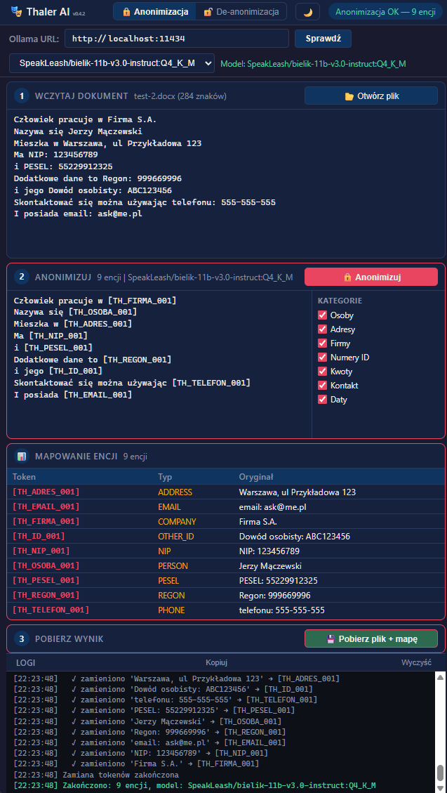

# Thaler AI

> **Early access** — prosta aplikacja w aktywnym rozwoju. Podstawowe funkcje dzialaja stabilnie, ale moga wystepowac zmiany w interfejsie i zachowaniu miedzy wersjami.

Proste narzedzie do anonimizacji dokumentow z wykorzystaniem lokalnego LLM (Ollama). Wykrywa dane wrazliwe (osoby, firmy, adresy, numery identyfikacyjne, kwoty, dane kontaktowe) i zastepuje je deterministycznymi tokenami.

- Bez konta, bez chmury, bez konfiguracji — zainstaluj, uruchom, uzyj
- Cale przetwarzanie odbywa sie lokalnie przez Ollama — dane nie trafiaja do zadnych uslug chmurowych
- Jeden plik binarny, zero zaleznosci



## Wymagania

- Linux (x86_64) — testowane na Ubuntu/WSL2, Debian
- Windows (x86_64) — testowane na Windows 10/11
- [Ollama](https://ollama.ai/) z zainstalowanym modelem AI (np. Bielik, Gemma)
- Przegladarka internetowa (Chrome, Firefox, Edge)

## Instalacja

Pobierz najnowsza wersje z [GitHub Releases](https://github.com/george7979/thaler-ai/releases).

### Linux (.deb)

```bash
sudo dpkg -i thaler-ai_<wersja>_amd64.deb
```

Odinstalowanie:

```bash
sudo dpkg -r thaler-ai
```

### Windows (.msi)

Uruchom instalator `thaler-ai-<wersja>-x86_64.msi` — aplikacja zainstaluje sie w Program Files, pojawi sie w menu Start i w "Dodaj/Usun programy".

> **Uwaga:** Aplikacja nie jest podpisana cyfrowo. Przy pierwszym uruchomieniu Windows SmartScreen moze wyswietlic ostrzezenie. Kliknij **Wiecej informacji** → **Uruchom mimo to**.

Odinstalowanie: Panel sterowania → Programy → Odinstaluj program → Thaler AI.

## Uruchomienie

```bash
thaler-ai
```

Aplikacja uruchomi serwer HTTP na localhost i automatycznie otworzy przegladarke.

## Konfiguracja Ollama

Po uruchomieniu aplikacji:

1. W polu **Ollama URL** wpisz adres swojej instancji Ollama (domyslnie `http://localhost:11434`). Jesli Ollama dziala na innej maszynie w sieci, wpisz jej adres, np. `http://192.168.1.100:11434`
2. Kliknij **Sprawdz** — aplikacja polczy sie z Ollama i zaladuje liste dostepnych modeli
3. Wybierz model z listy rozwijanej

Przetestowane modele:
- **Bielik 11B** (Q8_0) — szybki, zoptymalizowany pod jezyk polski
- **Gemma4 26B** (A4B Q4_K_M) — wolniejszy, ale dokladniejszy

## Anonimizacja

1. Kliknij **Otworz plik** i wybierz dokument (XLSX, DOCX, MD, TXT, CSV)
2. Podglad tresci pojawi sie w panelu wejsciowym
3. W panelu **Kategorie** (po prawej) zaznacz/odznacz typy danych do anonimizacji:
   - **Osoby** — imiona i nazwiska
   - **Adresy** — ulice, miasta, kody pocztowe
   - **Firmy** — nazwy firm, spolek, instytucji
   - **Numery ID** — NIP, REGON, KRS, PESEL, numery umow, inne identyfikatory
   - **Kwoty** — kwoty pieniezne, numery kont bankowych
   - **Kontakt** — numery telefonow, adresy email
   - **Daty** — konkretne daty

   Najedz myszka na checkbox, aby zobaczyc dokladne typy danych w tooltipie.

4. Kliknij **Anonimizuj** — model LLM przeanalizuje dokument i wykryje dane wrazliwe
5. Zanonimizowany tekst pojawi sie w panelu wyjsciowym, a tabela mapowania pokaze tokeny (np. `[TH_OSOBA_001]`, `[TH_FIRMA_002]`)
6. Kliknij **Pobierz plik + mape** — pobierzesz:
   - Zanonimizowany dokument (`.anon.docx` / `.anon.xlsx` / `.anon.md`)
   - Plik mapowania (`.map.json`) — przechowuj go bezpiecznie, jest potrzebny do odtworzenia oryginalnych danych

Zanonimizowany dokument mozesz bezpiecznie przeslac do chmurowych uslug AI (Claude, GPT, Gemini).

## De-anonimizacja

1. Przelacz tryb na **De-anonimizacja** (przycisk w naglowku)
2. Kliknij **Otworz plik .anon** i wybierz zanonimizowany dokument
3. Kliknij **Otworz mape** i wybierz odpowiedni plik `.map.json`
4. Kliknij **De-anonimizuj** — tokeny zostana zamienione z powrotem na oryginalne dane
5. Kliknij **Pobierz wynik** — otrzymasz odtworzony dokument

## Bezpieczenstwo

- Cale przetwarzanie odbywa sie lokalnie przez Ollama — zero danych w chmurze
- Serwer nasluchuje tylko na `127.0.0.1` — nie jest widoczny w sieci
- Mapowanie trzymane w RAM podczas sesji; zapisywane na dysk tylko na jawne zadanie uzytkownika
- Brak telemetrii, brak polaczen zewnetrznych
- Aplikacja nie tworzy plikow konfiguracyjnych ani nie zapisuje niczego na dysku — kazda sesja startuje od zera, ustawienia (URL Ollama, model, kategorie) istnieja tylko w pamieci do momentu zamkniecia przegladarki

## Budowanie ze zrodel

```bash
cd src-tauri
cargo build --release
```

Binary: `src-tauri/target/release/thaler-ai`

## Dokumentacja projektu

Dokumentacja techniczna projektu (PRD, PLAN, TECH) prowadzona jest zgodnie z metodyka [Context Keeper Method (CKM)](https://github.com/george7979/context-keeper-method) — znajduje sie w katalogu `docs/`.

## Licencja

MIT
